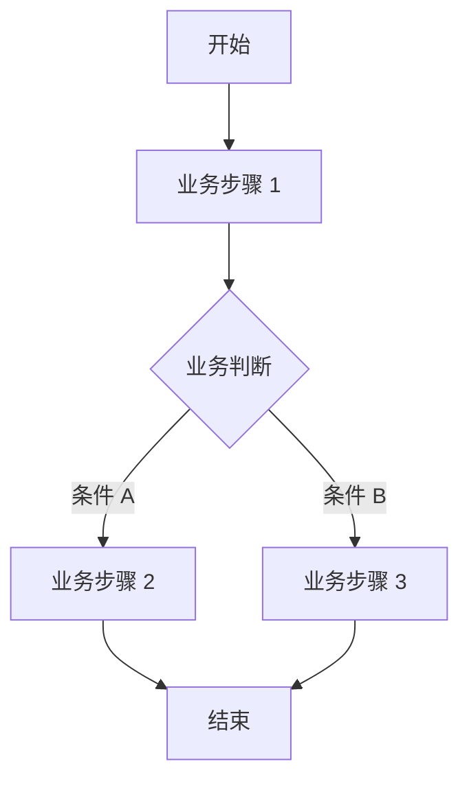

# 通用章节骨架


> **用途**：本文件是所有端类型（后端 / 前端 / 小程序）PRD 模板的共享骨架片段。
> 各端专用模板合并于 `templates/end-specific.md`，按端跳转对应 `##` 节获取专属章节，
> 端专属章节在各自模板中独立定义。
>
> ⚠️ **内容规则（强制）**：
> - 【规则 R-001】PRD 文档中**禁止出现任何技术性描述**，包括但不限于：框架名称、编程语言、数据库类型、API 协议、部署方式、技术选型等。
> - 【规则 R-002】所有描述必须是**业务语言**：描述"做什么"和"为什么"，而非"怎么实现"。
> - 【规则 R-003】违反 R-001 的内容一律删除，不得以任何形式保留在 PRD 文档中。

---

### 文档头部（每份文档必填）

> 版本号格式规则（vMAJOR.MINOR.PATCH）及变更类型标记说明见 `resources/filling-guide.md` 第 11 节。

```markdown
# [项目名称] — 产品需求文档 (PRD)

**文档编号**：PRD-YYYYMMDD-NNN
**版本**：v1.0.0
**状态**：🟡 草稿
**创建日期**：YYYY-MM-DD
**最后更新**：YYYY-MM-DD
**作者**：[姓名]
**审核人**：[姓名 / 待定]
**关联文档**：无
```

---

### 第 1 节：执行摘要

- **一句话定义**：`[产品名] 是一个 [目标用户] 用于 [核心业务功能] 的 [产品形态]，解决了 [核心业务痛点]。`
- **核心业务价值**：（说明该产品为用户或企业带来的业务价值，禁止描述技术实现）
- **预期成功指标**：（列出 2~3 个可量化的业务指标，如完成率、转化率、满意度等）

---

### 第 2 节：项目背景与目标

### 2.1 背景描述
> 描述业务痛点、市场机会或政策背景，说明为什么现在要做这个产品。

- **当前业务痛点**：（描述用户或业务方当前面临的问题）
- **市场机会 / 政策背景**：（可选，描述外部驱动因素）
- **立项时机**：（说明为什么是现在）

### 2.2 业务目标
> 目标必须符合 SMART 原则（具体、可衡量、可实现、相关、有时限）。
> ❌ 禁止：「提升用户体验」
> ✅ 正确：「上线后 3 个月内，用户任务完成率从 40% 提升至 65%」

| 目标编号 | 业务目标描述 | 时间框架 |
|---------|------------|---------|
| G-001 | [具体可衡量的业务目标] | [上线后 N 个月] |

### 2.3 成功指标（OKR / KPI）

| 指标名称 | 当前值 | 目标值 | 衡量方式 | 时间框架 |
|---------|-------|-------|---------|---------|
| [指标名] | [现状] | [目标] | [如何统计] | [时间] |

### 2.4 项目范围

**范围内（In Scope）：**
- [明确列出本次要做的业务功能]

**范围外（Out of Scope）：**
- [明确列出本次不做的内容，防止范围蔓延]

**假设条件：**
- [列出项目成立所依赖的前提假设]

---

### 第 3 节：用户角色与场景

### 3.1 用户画像

| 用户类型 | 描述 | 使用频率 | 核心业务需求 |
|---------|------|---------|------------|
| [用户类型] | [简要描述用户特征] | [每天/每周/偶尔] | [该用户最核心的业务诉求] |

### 3.2 使用场景

| 场景编号 | 场景描述 | 用户 | 业务目标 |
|---------|---------|------|---------|
| SC-001 | [描述用户在什么情况下使用该功能] | [用户类型] | [该场景下用户想达成的业务目标] |

### 3.3 用户旅程
> 描述用户完成核心业务目标的完整操作路径（业务流程，非技术流程）。

```
[用户类型] 完成 [核心业务目标] 的旅程：
步骤 1 → 步骤 2 → 步骤 3 → ... → 达成业务目标
```

---

### 第 4 节：功能需求

### 4.1 业务流程
> 使用泳道图描述核心业务流程，体现各角色的交互关系。



### 4.2 功能列表

> **验收标准（AC）规则**：每个 M/S 级功能必须包含至少 1 条 AC，格式为：
> `Given [业务前置条件] When [用户执行的业务操作] Then [业务预期结果]`
> ⚠️ AC 中禁止出现接口名称、字段名、HTTP 状态码等技术描述，只描述业务行为和业务结果。

| 模块 | 功能 | 业务描述 | 优先级 | 验收标准（AC） | 备注 |
|-----|------|---------|--------|--------------|------|
| [模块名] | [功能名] | [该功能解决什么业务问题，为用户带来什么业务价值] | M/S/C/W | Given [...] When [...] Then [...] | [业务备注] |

**MoSCoW 优先级说明：**

| 标记 | 含义 | 判断标准 |
|-----|------|---------|
| **M（Must Have）** | 必须有 | 没有此功能，核心业务无法运转 |
| **S（Should Have）** | 应该有 | 重要但非生死线，可在首版后补充 |
| **C（Could Have）** | 可以有 | 锦上添花，有余力再做 |
| **W（Won't Have）** | 不做 | 明确排除，防止范围蔓延 |

### 4.3 权限逻辑

| 用户角色 | 可见功能范围 | 可操作功能范围 | 限制条件 |
|---------|-----------|-------------|---------|
| [角色名] | [可以看到哪些功能] | [可以操作哪些功能] | [业务限制条件] |

---

### 第 6 节：数据需求

### 6.1 数据埋点

| 业务事件名称 | 触发业务场景 | 收集目的 |
|-----------|-----------|---------|
| [业务事件] | [用户在什么业务场景下触发] | [收集该数据用于什么业务分析] |

### 6.2 数据报表

| 报表名称 | 统计维度 | 刷新频率 | 业务用途 |
|---------|---------|---------|---------|
| [报表名] | [按什么维度统计] | [实时/每日/每周] | [该报表支撑什么业务决策] |

### 6.3 数据迁移（如适用）

- **迁移范围**：（描述需要迁移的业务数据范围）
- **迁移时间计划**：（描述迁移的业务时间窗口）
- **验证方案**：（描述如何验证迁移后业务数据的正确性）

---

### 第 7 节：非功能需求

> ⚠️ 本节只描述业务层面的质量要求，禁止出现具体技术参数（如框架版本、协议名称等）。

### 7.1 业务性能要求

| 业务场景 | 用户体验要求 | 业务并发规模 |
|---------|-----------|-----------|
| [业务操作场景] | [用户可接受的等待时长，如"秒级响应"] | [预计同时使用的用户规模] |

### 7.2 安全与合规要求

- **数据保护**：（描述哪些业务数据需要保护，保护级别）
- **访问控制**：（描述业务层面的权限管控要求）
- **隐私合规**：（描述需遵守的法律法规或行业规范，如《个人信息保护法》）
- **敏感操作**：（描述哪些业务操作需要二次确认或审批）

### 7.3 可用性要求

- **易用性标准**：（描述目标用户群体的操作能力要求）
- **无障碍访问**：（如适用，描述无障碍业务需求）
- **多语言**：（如适用，描述语言支持范围）

---

### 第 8 节：假设与风险 ⭐

> 本节记录项目成立的前提假设，以及假设不成立时的业务风险。

### 8.1 假设条件

| 假设编号 | 假设内容 | 影响范围 |
|---------|---------|---------|
| A-001 | [项目成立所依赖的业务前提] | [若假设不成立，影响哪些业务功能] |

### 8.2 风险清单

| 风险编号 | 风险描述 | 发生概率 | 影响程度 | 应对策略 |
|---------|---------|---------|---------|---------|
| R-001 | [业务风险描述] | 高/中/低 | 高/中/低 | [业务层面的应对措施] |

---

### 第 9 节：约束与依赖

### 9.1 业务依赖

| 依赖项 | 依赖描述 | 负责方 | 预计就绪时间 |
|-------|---------|-------|-----------|
| [依赖的业务系统或外部资源] | [依赖关系描述] | [负责方] | [时间] |

### 9.2 业务约束

- [必须对接的业务系统]
- [数据主权要求]
- [预算约束]
- [其他业务限制]

### 9.3 合规约束

- [适用的法律法规]
- [行业规范要求]
- [公司内部政策]

---

### 第 10 节：发布策略 ⭐

> 本节定义功能上线的业务发布方式。

### 10.1 发布方式

| 发布方式 | 适用业务场景 |
|---------|-----------|
| 全量发布 | 小范围业务调整、文案修改 |
| 灰度发布 | 核心业务功能上线、重大业务改版 |
| A/B 测试 | 业务流程优化、转化率提升 |
| 功能开关 | 需要随时开关的业务功能 |

**本次发布方式**：[选择上述方式并说明原因]

### 10.2 灰度策略（如适用）

- **灰度阶段一**：灰度比例 [X%]，观察 [N] 天，关注 [业务指标]
- **回滚条件**：[描述触发回滚的业务异常条件]
- **全量条件**：[描述满足什么业务指标后全量发布]

### 10.3 上线检查清单

- [ ] 所有 M 级功能通过业务验收
- [ ] 核心业务流程已完整测试
- [ ] 业务数据迁移已验证（如适用）
- [ ] 用户通知 / 公告已准备（如适用）
- [ ] 回滚方案已确认

---

### 第 11 节：名词解释与缩写

### 11.1 业务术语

| 术语 | 业务含义 |
|-----|---------|
| [术语] | [该术语在本业务场景下的含义] |

### 11.2 缩写列表

| 缩写 | 全称 | 业务含义 |
|-----|------|---------|
| [缩写] | [全称] | [业务含义] |

### 11.3 相关文档链接

| 文档名称 | 路径 / 链接 |
|---------|-----------|
| [文档名] | [路径] |

---

### 附录

- **参考资料**：（行业报告、竞品分析、用户调研数据等业务参考资料）

---

### 文档尾部（每份文档必填）

```markdown
## 变更记录

| 版本 | 日期 | 变更类型 | 变更内容摘要 | 变更人 |
|------|------|---------|------------|--------|
| v1.0.0 | YYYY-MM-DD | 🆕 新建 | 初始版本 | [作者] |
```

---

### 质量检查清单（通用部分，保存前逐项确认）

> **职责说明**：SKILL.md「输出前强制门禁」是 5 条**不可绕过的最高优先级门禁**（端文档完整性、无技术术语、AC 合规、元数据、多端概览）。本清单是**内容完整性详细参考**，在通过门禁后逐项确认，两者职责互补，均需通过。

**端文档完整性（最高优先级）：**
- [ ] **端文档完整性**：Step 0 锁定的每个端均已生成对应文档，实际生成文件数 = 锁定清单文件数

**内容规则合规性：**
- [ ] 【R-001】文档中无任何技术性描述（框架、语言、数据库、协议、部署方式等）
- [ ] 【R-002】所有描述均为业务语言，描述"做什么"和"为什么"
- [ ] 【R-003】AC 中无接口名称、字段名、HTTP 状态码等技术描述

**文档完整性：**
- [ ] 第 1~4 节、第 6~11 节已填写
- [ ] 没有使用模糊词汇（"更好"、"更快"、"更容易"等）
- [ ] 所有需求具体可衡量
- [ ] 功能列表每个功能有优先级标注
- [ ] **每个 M/S 级功能有至少 1 条 AC（Given/When/Then 格式）**
- [ ] 第 8 节假设与风险已填写（至少 2 条假设）
- [ ] 第 10 节发布策略已填写（明确发布方式）

**头部元数据：**
- [ ] 文档编号（PRD-YYYYMMDD-NNN）、版本（v1.0.0）、状态（🟡 草稿）、创建日期、最后更新、作者、关联文档
- [ ] 头部"版本"与变更记录最后一行版本一致
- [ ] 头部"最后更新"与变更记录最后一行日期一致
- [ ] 文档最后一节是 `## 变更记录`，含 v1.0.0 初始版本行
