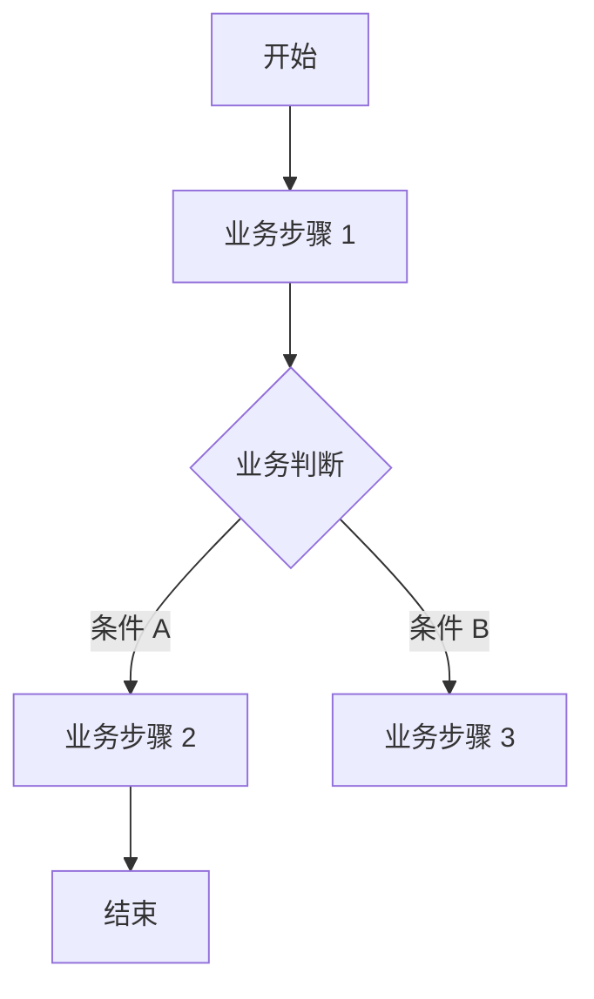

# 通用章节骨架

> **用途**：本文件是所有端类型（后端 / 前端 / 小程序）PRD 模板的共享骨架片段。
> ⚠️ **内容规则（强制）**：
> - 【R-001】禁止出现任何技术性描述（框架、语言、数据库、API 协议、部署方式等）
> - 【R-002】所有描述必须是**业务语言**：描述"做什么"和"为什么"
> - 【R-003】违反 R-001 的内容一律删除

### 文档头部（每份文档必填）
```
# [项目名称] — 产品需求文档 (PRD)
**文档编号**：PRD-YYYYMMDD-NNN | **版本**：v1.0.0 | **状态**：🟡 草稿
**创建日期**：YYYY-MM-DD | **最后更新**：YYYY-MM-DD
**作者**：[姓名] | **审核人**：[姓名 / 待定] | **关联文档**：无
```

### 第 1 节：执行摘要
- **一句话定义**：`[产品名] 是一个 [目标用户] 用于 [核心业务功能] 的 [产品形态]，解决了 [核心业务痛点]。`

### 第 2 节：项目背景与目标
#### 2.1 背景描述
- **当前业务痛点**：[描述] | **立项时机**：[说明为什么是现在]

#### 2.2 业务目标
| 目标编号 | 业务目标描述 | 时间框架 |
|---------|------------|---------|
| G-001 | [具体可衡量的业务目标] | [上线后 N 个月] |

#### 2.3 成功指标（OKR / KPI）
| 指标名称 | 当前值 | 目标值 | 衡量方式 | 时间框架 |
|---------|-------|-------|---------|---------|
| [指标名] | [现状] | [目标] | [如何统计] | [时间] |

#### 2.4 项目范围
**范围内：** [本次要做的业务功能] | **范围外：** [本次不做的内容] | **假设条件：** [项目依赖的前提假设]（按实际填写）

### 第 3 节：用户角色与场景
#### 3.1 用户画像
| 用户类型 | 描述 | 使用频率 | 核心业务需求 |
|---------|------|---------|------------|
| [用户类型] | [简要描述] | [每天/每周/偶尔] | [核心业务诉求] |

#### 3.2 使用场景
| 场景编号 | 场景描述 | 用户 | 业务目标 |
|---------|---------|------|---------|
| SC-001 | [使用场景描述] | [用户类型] | [达成目标] |

#### 3.3 用户旅程
```
[用户类型] 完成 [核心业务目标] 的旅程：
步骤 1 → 步骤 2 → 步骤 3 → ... → 达成业务目标
```

### 第 4 节：功能需求
#### 4.1 业务流程

```mermaid
flowchart TD
    A[开始] --> B[业务步骤 1] --> C{业务判断}
    C -->|条件 A| D[业务步骤 2]
    C -->|条件 B| E[业务步骤 3]
    D --> F[结束]
```

#### 4.2 功能列表
> **AC 格式**：`Given [业务前置条件] When [用户操作] Then [业务预期结果]`
> ⚠️ AC 中禁止出现接口名称、字段名、HTTP 状态码等技术描述。
| 模块 | 功能 | 业务描述 | 优先级 | 验收标准（AC） | 备注 |
|-----|------|---------|--------|--------------|------|
| [模块名] | [功能名] | [解决什么业务问题] | M/S/C/W | Given/When/Then | [备注] |

**MoSCoW 优先级：** M=必须有(核心业务无法运转) S=应该有(重要非生死线) C=可以有(锦上添花) W=不做(防止范围蔓延)

#### 4.3 权限逻辑
| 用户角色 | 可见功能范围 | 可操作功能范围 | 限制条件 |
|---------|-----------|-------------|---------|
| [角色名] | [可看到的功能] | [可操作的功能] | [业务限制条件] |

### 第 6 节：数据需求
#### 6.1 数据埋点
| 业务事件 | 触发业务场景 | 收集目的 |
|---------|-----------|---------|
| [业务事件] | [触发场景] | [业务分析用途] |

#### 6.2 数据报表
| 报表名称 | 统计维度 | 刷新频率 | 业务用途 |
|---------|---------|---------|---------|
| [报表名] | [维度] | [实时/每日/每周] | [支撑的业务决策] |

#### 6.3 数据迁移（如适用）
- **迁移范围**：[业务数据范围] | **迁移时间**：[时间窗口] | **验证方案**：[验证方式]

### 第 7 节：非功能需求
#### 7.1 业务性能要求
| 业务场景 | 用户体验要求 | 业务并发规模 |
|---------|-----------|-----------|
| [业务操作场景] | [用户可接受的等待时长] | [预计同时使用用户规模] |

#### 7.2 安全与合规要求
- **数据保护**：[哪些数据需要保护及级别] | **隐私合规**：[适用的法律法规] | **敏感操作**：[需二次确认或审批的操作]

#### 7.3 可用性要求（如适用）
- **易用性**：[目标用户操作能力要求] | **多语言**：[语言支持范围]（按实际填写）

### 第 8 节：假设与风险
#### 8.1 假设条件
| 假设编号 | 假设内容 | 影响范围 |
|---------|---------|---------|
| A-001 | [业务前提假设] | [影响哪些功能] |

#### 8.2 风险清单
| 风险编号 | 风险描述 | 发生概率 | 影响程度 | 应对策略 |
|---------|---------|---------|---------|---------|
| R-001 | [业务风险] | 高/中/低 | 高/中/低 | [业务应对措施] |

### 第 9 节：约束与依赖
#### 9.1 业务依赖
| 依赖项 | 依赖描述 | 负责方 | 预计就绪时间 |
|-------|---------|-------|-----------|
| [业务系统/资源] | [依赖关系] | [负责方] | [时间] |

#### 9.2 业务约束
- [业务系统对接要求] | [数据主权要求] | [预算约束] | [其他限制]（按实际填写）

#### 9.3 合规约束
- [适用的法律法规] | [行业规范] | [公司内部政策]（按实际填写）

### 第 10 节：发布策略
#### 10.1 发布方式
| 发布方式 | 适用业务场景 |
|---------|-----------|
| 全量发布 → 小范围调整、文案修改 | 灰度发布 → 核心业务上线、重大改版 |
| A/B 测试 → 流程优化、转化率提升 | 功能开关 → 随时开关的功能 |

**本次发布方式**：[选择上述方式并说明原因]

#### 10.2 灰度策略（如适用）
- **灰度阶段**：比例 [X%]，观察 [N] 天，关注 [业务指标]
- **回滚条件**：[触发回滚的业务异常条件] | **全量条件**：[满足的业务指标]

#### 10.3 上线检查清单
- [ ] M 级功能通过业务验收 | [ ] 核心流程已测试 | [ ] 数据迁移已验证 | [ ] 用户通知已准备 | [ ] 回滚方案已确认

### 第 11 节：名词解释与缩写
#### 11.1 业务术语
| 术语 | 业务含义 |
|-----|---------|
| [术语] | [在本业务场景下的含义] |

#### 11.2 缩写列表
| 缩写 | 全称 | 业务含义 |
|-----|------|---------|
| [缩写] | [全称] | [业务含义] |

#### 11.3 相关文档链接
| 文档名称 | 路径 |
|---------|------|
| [文档名] | [路径] |

### 附录
- **参考资料**：（行业报告、竞品分析、用户调研数据等）

### 文档尾部（每份文档必填）
```
## 变更记录
| 版本 | 日期 | 变更类型 | 变更内容摘要 | 变更人 |
|------|------|---------|------------|--------|
| v1.0.0 | YYYY-MM-DD | 🆕 新建 | 初始版本 | [作者] |
```

### 质量检查清单（保存前逐项确认）
**端文档完整性（最高优先级）：** - [ ] 实际生成文件数 = 锁定清单文件数

**内容规则合规性：**
- [ ] 【R-001】无任何技术性描述 | 【R-002】所有描述为业务语言 | 【R-003】AC 中无接口名称、字段名、状态码

**文档完整性：**
- [ ] 第 1~4 节、第 6~11 节已填写 | 无模糊词汇，需求具体可衡量，功能列表均有优先级标注
- [ ] 每个 M/S 级功能有 ≥1 条 AC（Given/When/Then 格式）
- [ ] 第 8 节假设与风险已填写（≥2 条假设）| 第 10 节发布策略已填写

**头部元数据：**
- [ ] 文档编号（PRD-YYYYMMDD-NNN）、版本（v1.0.0）、状态（🟡 草稿）、日期、作者、关联文档齐全
- [ ] 头部版本 / 最后更新与变更记录最后一行一致
- [ ] 最后一节是 `## 变更记录`，含 v1.0.0 初始版本行
