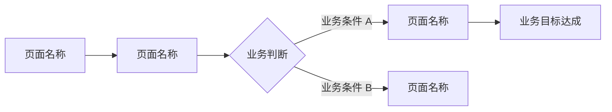

# 端专属章节

> **用途**：本文件包含三个端（后端 / Web 前端 / 微信小程序）的 PRD 专属章节模板，用 `---` 分隔，按需跳转到对应端。
> **组合方式**：通用章节来自 `templates/common.md`，按端加载对应专属章节。

---

## 后端专属章节

> **用途**：纯后端服务 PRD 文档模板。适用于无前端的后端服务、数据处理服务、业务规则引擎等场景。
>
> ⚠️ **内容规则**：同 common.md 通用规则。另【R-004】本模板不含第 5 节（用户界面需求），该章节仅属于前端/小程序端。

### 加载说明

| 章节来源 | 章节内容 |
|---------|---------|
| `templates/common.md` | 文档头部、第 1~4 节、第 6~11 节、文档尾部、通用质量检查清单 |
| 本文件 `## 后端专属章节` | 第 5 节（后端专属：业务规则与数据规范）、后端专属质量检查清单 |

---

### 第 5 节：业务规则与数据规范（后端专属）

> ⚠️ 禁止描述具体的数据结构、字段定义、接口协议等技术内容，只描述业务规则。

### 5.1 核心业务规则

| 规则编号 | 业务规则描述 | 适用场景 | 违反后果 |
|---------|-----------|---------|---------|
| BR-001 | [如"同一用户同一天只能提交一次申请"] | [适用场景] | [违反时的业务处理方式] |

### 5.2 业务数据规范

> ⚠️ 禁止描述数据库表结构、字段类型、索引等技术内容。

- **数据保留策略**：[基于合规要求的数据保留时长]
- **数据归档规则**：[归档触发条件]
- **数据清理规则**：[清理条件和审批要求]
- **数据一致性要求**：[跨模块数据一致性业务要求]

### 5.3 业务流程约束

| 约束编号 | 业务流程约束描述 | 前置条件 | 后置条件 |
|---------|--------------|---------|---------|
| PC-001 | [如"审批通过后才能执行下一步"] | [前置业务条件] | [达到的业务状态] |

### 5.4 业务异常处理规范

| 业务异常场景 | 业务处理方式 | 是否需要人工介入 | 通知对象 |
|------------|-----------|--------------|---------|
| [异常场景] | [处理方式] | 是/否 | [通知方] |

### 后端 PRD 专属质量检查清单

**内容规则合规性：**
- [ ] 【R-001】无技术描述 | 【R-002】均为业务语言 | 【R-004】不含用户界面章节

**后端专属完整性：**
- [ ] 5.1 核心业务规则已填写（≥2 条）
- [ ] 5.2 业务数据规范已填写（保留策略已明确）
- [ ] 5.3 业务流程约束已填写
- [ ] 5.4 业务异常处理已填写（覆盖所有核心异常场景）

**拆分文档完整性（含其他端时）：**
- [ ] 配套的 `{项目名}_PRD_前端.md` / `{项目名}_PRD_小程序.md` 已生成
- [ ] `{项目名}_PRD_概览.md` 已生成（含端类型声明和各端文档路径）

**文件存储：** [ ] 文件路径：`doc/prd/{项目名}_PRD_后端.md`

---

## Web 前端专属章节

> **用途**：Web 前端 PRD 文档模板。适用于桌面端/响应式 Web 应用的 UI 界面需求。
>
> 本节结构与微信小程序第 5 节格式一致，仅以下差异：
> - **无** 5.2 底部导航结构 → 改为 **5.6 导航与信息架构**（导航菜单+面包屑层级）
> - **无** 5.5 微信生态能力需求（Web 端不需要）
> - **无** 5.8 分包与离线需求
> - 其余子节编号对应：5.1 端类型声明、5.2 页面清单、5.3 核心交互流程、5.4 页面交互细节、5.5 UI 视觉风格要求

### 加载说明

| 章节来源 | 章节内容 |
|---------|---------|
| `templates/common.md` | 文档头部、第 1~4 节、第 6~11 节、文档尾部、通用质量检查清单 |
| 本文件 `## Web 前端专属章节` | 第 5 节（前端专属：用户界面需求，插入第 4 节后、第 6 节前）、前端专属质量检查清单 |

### 前端 PRD 专属质量检查清单

**内容规则合规性（最高优先级）：**
- [ ] 【R-001】文档中无框架名称（Vue/React/Angular）、组件库名称、构建工具等技术描述
- [ ] 【R-005】界面描述只有业务交互行为和视觉风格，无组件名称、路由路径等技术内容
- [ ] 第 5 节所有描述均为业务语言和用户视角

**前端专属完整性：**
- [ ] 5.1 端类型声明已填写（响应式要求已勾选）
- [ ] 5.2 页面清单已填写（所有 M 级页面已列出）
- [ ] 5.3 核心交互流程已填写（≥1 个核心业务流程）
- [ ] 5.4 页面交互细节已填写（≥M 级页面 4 种状态）
- [ ] 5.5 UI 视觉风格要求已填写
- [ ] 5.6 导航与信息架构已填写

**拆分文档完整性（含后端时）：**
- [ ] 配套的 `{项目名}_PRD_后端.md` 已生成
- [ ] `{项目名}_PRD_概览.md` 已生成

**文件存储：** [ ] `doc/prd/{项目名}_PRD_前端.md`

---

## 微信小程序专属章节

> **用途**：微信小程序 PRD 文档模板。适用于小程序用户端、服务号小程序等场景。
>
> ⚠️ **内容规则（强制）**：
> - 【R-001】禁止出现小程序框架名称、技术文件类型、云开发等技术方案
> - 【R-002】所有描述为业务语言：描述"用户看到什么"和"用户能做什么"
> - 【R-006】微信能力描述只描述**业务目的**，禁止具体微信接口名称

### 加载说明

| 章节来源 | 章节内容 |
|---------|---------|
| `templates/common.md` | 文档头部、第 1~4 节、第 6~11 节、文档尾部、通用质量检查清单 |
| 本文件 `## 微信小程序专属章节` | **第 5 节**（小程序专属：用户界面需求，插入在第 4 节后、第 6 节前）、小程序专属质量检查清单 |

### 第 5 节：用户界面需求（小程序专属）

> ⚠️ 禁止出现技术接口名称、框架名称、技术实现方案，只描述用户看到什么、能做什么。

#### 5.1 端类型声明

| 端类型 | 目标用户群体 | 主要使用场景 | 设计风格参考 |
|-------|-----------|-----------|-----------|
| 微信小程序 | [目标用户描述] | [如"外出时随时查询"] | [如有设计稿或品牌规范，在此说明] |

#### 5.2 底部导航结构

> 最多 5 个导航入口。如无底部导航（单页/纯功能型），在此说明原因。

| 序号 | 导航名称 | 对应业务功能 | 图标说明 |
|-----|---------|-----------|---------|
| 1 | [导航名称] | [核心业务功能] | [图标风格描述] |

#### 5.3 页面清单

| 页面名称 | 所属业务模块 | 优先级 | 页面业务说明 | 入口来源 |
|---------|-----------|-------|-----------|---------|
| [页面名称] | [模块] | M/S/C | [业务目的和核心内容] | [如"底部导航"、"扫码"、"分享链接"] |

#### 5.4 核心交互流程

> ⚠️ 流程图中只描述业务步骤和页面名称，禁止出现页面路径等技术内容。

**核心流程说明：**

| 流程名称 | 流程描述 | 涉及页面 |
|---------|---------|---------|
| [业务流程名] | [操作路径描述] | [涉及的页面列表] |

#### 5.5 微信生态能力需求

> ⚠️ 只描述业务目的，禁止具体的微信接口名称。仅填写实际需要的能力，删除不需要的行。

| 微信能力 | 业务目的 | 优先级 | 业务说明 |
|---------|---------|-------|---------|
| 微信账号登录 | 用户用微信账号直接登录，无需单独注册 | M/S/C | [补充业务场景] |
| 微信支付 | 用户在小程序内完成支付，无需跳转 | M/S/C | [支付场景说明] |
| 消息推送通知 | 业务事件主动通知用户 | M/S/C | [需推送的业务事件] |
| 位置获取 | 获取用户当前位置用于具体业务 | M/S/C | [位置的业务用途] |
| 扫码功能 | 用户扫描二维码完成业务操作 | M/S/C | [扫码的业务场景] |
| 图片/文件上传 | 用户上传业务相关内容 | M/S/C | [上传内容的业务用途] |
| 分享功能 | 用户分享业务内容给微信好友/朋友圈 | M/S/C | [分享的业务场景] |

#### 5.6 页面交互细节

> ⚠️ 只描述用户看到的内容和业务反馈，禁止技术实现方式。

| 页面名称 | 正常状态 | 加载中状态 | 空数据状态 | 业务错误状态 |
|---------|---------|---------|---------|-----------|
| [页面名称] | [正常情况下用户看到什么] | [加载时用户看到什么] | [无数据时用户看到什么] | [出错时用户看到什么、如何引导] |

#### 5.7 UI 视觉风格要求

> ⚠️ 禁止描述具体的样式属性值、设计系统名称等技术内容。

- **整体风格**：（如简洁轻量、活泼年轻、专业严谨等）
- **主色调**：（描述品牌色或色彩倾向）
- **字体规范**：（如"正文清晰易读，适合小屏阅读"）
- **图标风格**：（如线性图标、填充图标、统一风格等）
- **品牌规范参考**：（如有现有品牌规范文档，在此引用）

#### 5.8 分包与离线需求

> ⚠️ 只描述业务需求，禁止技术实现方式。

**分包需求：** [ ] 无分包需求 | [ ] 需要分包（原因：[如"部分功能使用频率低"]）

**离线使用需求：** [ ] 无离线需求 | [ ] 支持离线（功能：[具体业务功能]）

### 小程序 PRD 专属质量检查清单

**内容规则合规性（最高优先级）：**
- [ ] 【R-001】无框架/技术文件/云开发等技术描述
- [ ] 【R-006】微信能力描述只有业务目的，无具体微信接口名称
- [ ] 第 5 节所有描述均为业务语言和用户视角

**小程序专属完整性：**
- [ ] 5.1 端类型声明已填写
- [ ] 5.2 底部导航结构已填写（或说明原因）
- [ ] 5.3 页面清单已填写（所有 M 级页面已列出，含入口来源）
- [ ] 5.4 核心交互流程已填写（≥1 个核心业务流程）
- [ ] 5.5 微信生态能力需求已填写（仅保留实际需要的能力）
- [ ] 5.6 页面交互细节已填写（≥M 级页面 4 种状态）
- [ ] 5.7 UI 视觉风格要求已填写
- [ ] 5.8 分包与离线需求已勾选

**拆分文档完整性（含后端时）：**
- [ ] 配套的 `{项目名}_PRD_后端.md` 已生成
- [ ] `{项目名}_PRD_概览.md` 已生成

**文件存储：** [ ] `doc/prd/{项目名}_PRD_小程序.md`
